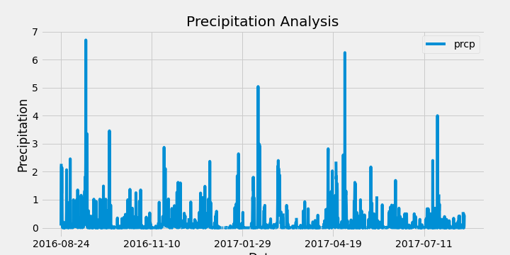
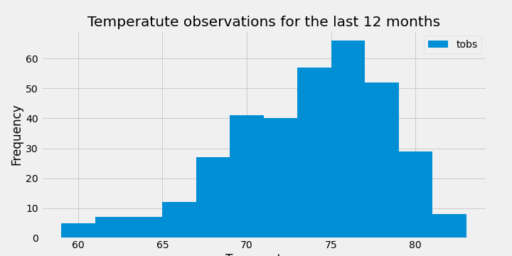

# SQLAlchemy Homework - Surfs Up!

(Image Source: Google search, Bamba Travel)

This assignment is on the climate analysis on Honolulu, Hawaii.

## Step 1 - Climate Analysis and Exploration

The task involved use of Python and SQLAlchemy to do basic climate analysis and data exploration of the climate database. All of the following analysis were completed using SQLAlchemy ORM queries, Pandas, and Matplotlib.

* The resources included the sqlite data for climate analysis and data exploration.

* The SQLAlchemy `create_engine` was used to connect to the sqlite database.

* The SQLAlchemy `automap_base()` was used to reflect the tables into classes and a reference to those classes called `Station` and `Measurement` were assigned.

* Python was linked to the database by creating an SQLAlchemy session.

### Precipitation Analysis

* The task was started by finding the most recent date in the data set.

* Using this date, the last 12 months of precipitation data was retrieved by querying the 12 preceding months of data.

* The `date` and `prcp` values were selected for analysis.

* The query results were loaded into a Pandas DataFrame and the index was set to the date column.

* The DataFrame values were sorted by `date`.

* The results were plotted using the DataFrame `plot` method.

  

* Pandas was used to print the summary statistics for the precipitation data.

### Station Analysis

* The query was designed to calculate the total number of stations in the dataset.

* A query was designed to find the most active stations (i.e. which stations had the most rows).

* The stations and observation counts were listed in descending order.

* The station id with the highest number of observations was identified.

* Using the most active station id, the lowest, highest, and average temperature was calculated.

* The function `func.min`, `func.max`, `func.avg`, and `func.count` were incorporated in the queries.

* A query was designed to retrieve the last 12 months of temperature observation data (TOBS).

* The station with the highest number of observations was used for filtering the data.

* The last 12 months of temperature observation data for this station was retrieved using the query.

* The results are plotted in a histogram with `bins=12`.

- - -

## Step 2 - Climate App

The task involved here was to design a Flask API based on the queries that were developed during the initial analysis.

* Flask was used to create the different routes. The details of the routes are as below.

### Routes

* `/`

  * Home page.

  * Lists all routes that are available.

* `/api/v1.0/precipitation`

  * Returns the JSON representation of the precipitation dictionary.

* `/api/v1.0/stations`

  * Returns a JSON list of stations from the dataset.

* `/api/v1.0/tobs`

  * Returns a JSON list of temperature observations (TOBS) for the previous year.

* `/api/v1.0/<start>` and `/api/v1.0/<start>/<end>`

  * Returns a JSON list of the minimum temperature, the average temperature, and the max temperature for a given start or start-end range.

  * When given the start only, it calculates `TMIN`, `TAVG`, and `TMAX` for all dates greater than and equal to the start date.

  * When given the start and the end date, it calculates the `TMIN`, `TAVG`, and `TMAX` for dates between the start and end date inclusive.

